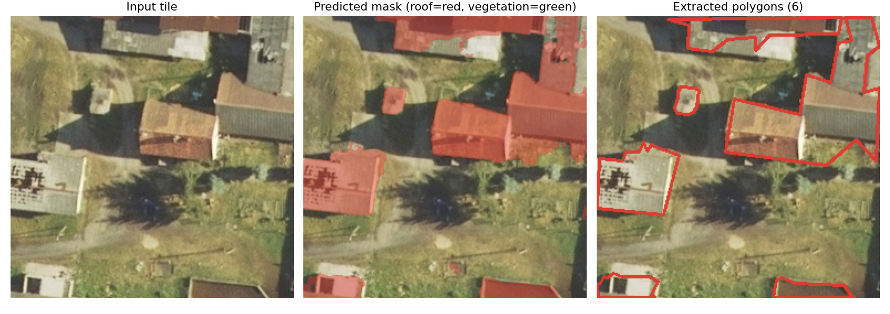
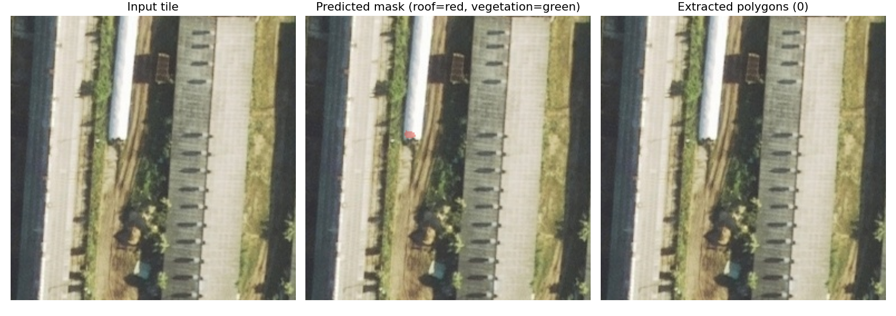

# QuickQuote — property-feature segmentation

I'm building QuickQuote, a B2B SaaS concept where a homeowner pulls up a
satellite view of their property, the relevant region (roof, lawn, driveway)
is highlighted automatically, they pick a service for that region, and they
get a quote. This repo is the computer vision core: a semantic segmentation
model that finds roofs and vegetation in aerial imagery and converts them
into polygon boundaries a frontend can highlight and measure.

## Why segmentation

Quotes scale with area. Object detection gives axis-aligned bounding boxes,
which overstate the area of anything that isn't a rectangle and can't be
rendered as a tight region highlight. Per-pixel segmentation follows the
actual roof/lawn outline, so the polygon is both the UI highlight and the
area estimate. OpenCV `findContours` bridges the two: class map in, polygons
out.

## Pipeline

```
LandCover.ai orthophotos
  → prepare_data.py   tile to 256×256, remap to 3 classes, 70/15/15 split
                      (split at source-image level to avoid spatial leakage)
  → train.py          U-Net, ImageNet-pretrained ResNet34 encoder,
                      Dice + cross-entropy loss, Adam @ 1e-4,
                      early stop on val-loss plateau
  → evaluate.py       per-class IoU / Dice on held-out test set → metrics.json
  → infer.py          class map → findContours → simplified polygons
                      + overlay visualizations
```

Design decisions I'd defend in a review:

- **Image-level split.** Tiles from one orthophoto share texture, season and
  lighting; splitting at the tile level leaks near-duplicates into val/test
  and inflates every metric. The 33 source images are split 70/15/15 first,
  then tiled.
- **3-class scope** (background / roof / vegetation). LandCover.ai also
  labels water and roads; v1 maps them to background. A working narrow model
  beats a broken wide one.
- **Dice + CE loss, IoU/Dice reporting.** Most pixels are background, so
  pixel accuracy rewards a model that finds nothing. Dice optimizes region
  overlap per class; cross-entropy stabilizes optimization.
- **Pretrained encoder.** With a few thousand tiles, ImageNet features are
  adapted (all layers trainable at lr 1e-4) rather than learned from scratch.

## Results

Trained 2026-08-04 on a T4 GPU. 4,000 train / 800 val / 800 test tiles,
split at the source-image level. 25 epochs, early-stopped after 8 without
validation improvement; best checkpoint epoch 17. Every number below comes
from `outputs/metrics.json`, written by `evaluate.py` against the held-out
test set.

| Class | IoU | Dice | Recall | Precision |
|---|---|---|---|---|
| background | 0.8494 | 0.9186 | 0.9436 | 0.8949 |
| roof | 0.7043 | 0.8265 | 0.7928 | 0.8632 |
| vegetation | 0.8095 | 0.8947 | 0.8641 | 0.9277 |
| **mean** | **0.7878** | **0.8799** | | |

Inference: 3.86 ms per 256×256 tile on the T4.

Roof is the hardest class and the one the product depends on most. It's also
the rarest — 2.1M roof pixels in the test set against 29.5M background — and
the highest-detail, so boundary error costs proportionally more. Roof recall
(0.793) sitting below roof precision (0.863) means the model misses roof
area more often than it invents it, which biases quotes low. The confusion
matrix shows why: 20.5% of true roof pixels are predicted as background,
while only 5,453 are confused with vegetation. The failure is missed roofs,
not misclassified ones.



*Input tile → predicted mask → extracted polygons. Pitched residential roofs
like these are the QuickQuote target case and segment cleanly.*



*Failure case: large flat industrial roofs whose texture matches adjacent
pavement. The model finds one small patch, which then falls below the
100 px contour threshold — so the tile yields zero polygons. Written up in
[LIMITATIONS.md](LIMITATIONS.md).*

Full per-epoch training curve: [`outputs/training_log.csv`](outputs/training_log.csv).

## Project status

| Component | Status |
|---|---|
| Segmentation pipeline (data → train → eval → polygons) | Trained and evaluated — see Results |
| Polygon extraction (class map → contours → simplified polygons) | Implemented |
| Frontend (satellite view, region highlight, service selection) | Planned |
| Pricing v1: deterministic area-based rate card (`src/pricing.py`) | Implemented |
| Comp-based pricing (location + neighbor spend ML) | Planned — requires transaction data |

## Pricing

`src/pricing.py` turns extracted polygons into a quote: pixel area × GSD²
(meters per pixel of the source imagery) → square feet → per-sqft rate for
the selected service (roofing / mowing / landscaping), with a small-job
floor. Rates are configurable demo values, not market data. The comp-based
component — adjusting quotes by what neighboring properties paid — is an
explicit stub (`comp_adjustment()` returns 1.0) because it needs historical
transaction data that doesn't exist yet; the stub documents the intended v2.

```bash
python src/pricing.py outputs/samples/polygons_00.json --service roofing
```

## Setup

```bash
python -m venv .venv && source .venv/bin/activate
pip install -r requirements.txt

python src/download_data.py    # LandCover.ai v1, ~1.5 GB, resumable
python src/prepare_data.py     # tiles + split
python src/train.py --smoke    # 2-epoch pipeline sanity check
python src/train.py            # full training run
python src/evaluate.py         # writes outputs/metrics.json
python src/infer.py --n 8      # writes outputs/samples/
```

GPU recommended (a Colab T4 trains in well under an hour); CPU works but
takes hours. Knobs live in `config.py`.

## Repo map

```
config.py              every tunable, each with the reasoning next to it
src/download_data.py   resumable dataset download + extraction
src/prepare_data.py    tiling, class remap, leakage-safe split
src/dataset.py         Dataset + albumentations pipelines
src/train.py           training loop, CSV logging, checkpoints, early stop
src/evaluate.py        held-out IoU/Dice → metrics.json (sole source of truth)
src/infer.py           inference → contours → polygons + overlays
src/pricing.py         polygon area × GSD → rate-card quote (comps stubbed)
LIMITATIONS.md         only limitations actually observed, with evidence
CONCEPTS.md            the design reasoning, written to be explainable
```

## Limitations

Tracked in [LIMITATIONS.md](LIMITATIONS.md), written from observed behavior
only. The headline ones: roofs are under-segmented (20.5% of roof pixels
lost to background), large flat industrial roofs can fail completely, and
training showed mild overfitting from around epoch 10. Known by design:
training imagery is Polish aerial orthophotography (25/50 cm) while
production would consume maps-API satellite tiles — that domain gap is real
and untested.

## License

MIT — see [LICENSE](LICENSE).
